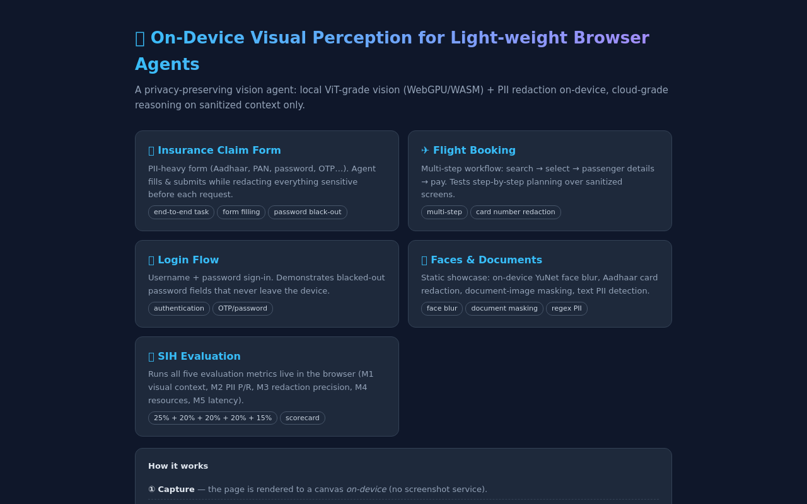
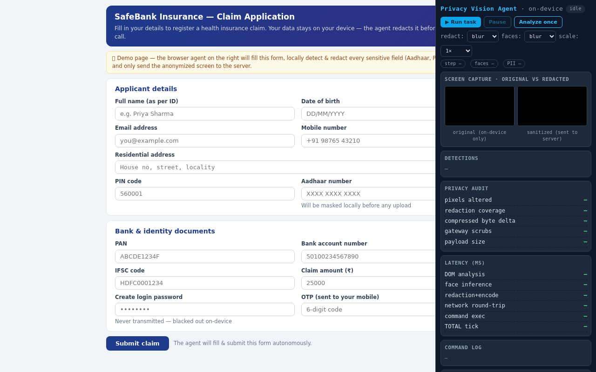
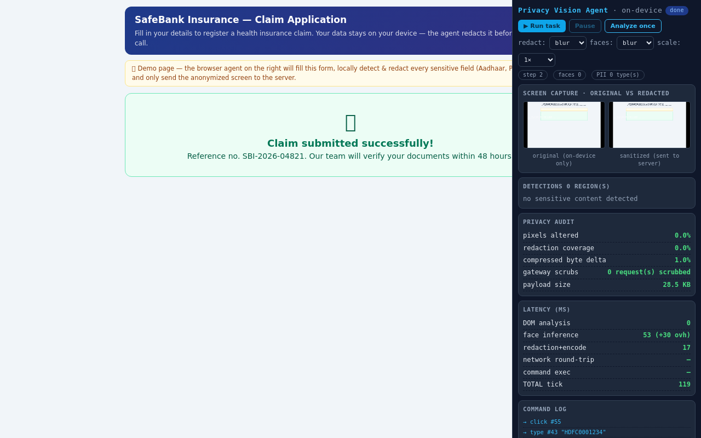

# 🛡️ Privacy Vision Agent — Lightweight Browser AI Agent

## 🚀 Smart India Hackathon 2026

> A browser agent that **sees web pages and completes tasks on them** (fill forms, click buttons) — while **detecting and redacting faces, passwords and PII on-device, before anything is sent to a server**.

**Scores:** harness evaluation **98.30/100** · in-browser scorecard **97.7/100** · browser smoke test **13/13** ✅

---

### Problem

Browser agents and AI assistants need to **"see" the rendered page** to act on it — but typical solutions send **full screenshots to cloud servers** for vision processing. That leaks faces, names, Aadhaar numbers, passwords and OTPs. Meanwhile, full vision models are **too heavy for everyday devices** and lightweight browsers.

**How do we give a browser agent eyes — without making it a spy?**

### Solution

**On-device visual perception + privacy-first pipeline.** The agent runs entirely in the browser:

1. **Extract** — reads page structure from the DOM (labels, fields, buttons — never typed values)
2. **See** — captures a page snapshot on-device + detects faces with **YuNet (232 KB)** via ONNX Runtime Web
3. **Detect PII** — classifies Aadhaar, PAN, phone, email, card, password, OTP, DOB… from field types, labels, autocomplete hints + regex text scan
4. **Redact** — blurs faces, solid-blacks passwords/OTPs, masks PII — with a **pixel + byte audit**
5. **Send** — only the **sanitized payload** (`pva/v1`: redacted image + label-only element map + audit) goes to the server; a **Privacy Gateway** re-scrubs every fetch/XHR as defense-in-depth
6. **Act** — the server planner returns **validated commands** (`type`, `click`, `scroll`…); the agent executes them locally and loops until `done`

**Core idea:** `PAGE → VISUAL PERCEPTION → COMPACT STATE → AGENT ACTION` — with **zero raw pixels leaving the device**.

### Key Features

- 🖥️ **On-device visual perception** — YuNet face detection in-browser (WebGPU → WASM fallback)
- 🔒 **PII detection & redaction** — 12+ categories, confidence tiers, pixel-level audit (0% leakage outside ground truth)
- ⚡ **WebGPU acceleration** — with automatic WASM fallback (~20 ms face inference)
- 🧠 **ONNX Runtime inference** — vendored locally, zero CDNs, works **fully offline**
- 🧩 **Chrome + Firefox extensions** — the same engine injected on any website (MV3 + MV2 builds)
- 🛡️ **Privacy-preserving AI pipeline** — 3 layers: redact-before-send, values never leave the client, fetch/XHR gateway
- 📊 **Measured, not claimed** — automated harness scoring the 5 SIH metrics + live in-browser scorecard

### Architecture

```
┌────────────────────────────── BROWSER (on-device) ──────────────────────────────┐
│                                                                                  │
│   Web page ──► DOM EXTRACTOR ──► element map (labels only, NO values)            │
│        │                                                                         │
│        └──► CANVAS SNAPSHOT ──► YuNet FACE DETECTOR (ONNX Runtime Web)           │
│                                     │                                            │
│                                     ▼                                            │
│              PII CLASSIFIER (field types + labels + autocomplete + regex)        │
│                                     │                                            │
│                                     ▼                                            │
│              REDACTOR ──► blur faces / black-out passwords / mask PII            │
│                    │         + pixel-delta + byte-delta audit                    │
│                    ▼                                                             │
│              PRIVACY GATEWAY (fetch/XHR interceptor — scrubs all traffic)        │
│                    │                                                             │
└────────────────────│─────────────────────────────────────────────────────────────┘
                     │  pva/v1 payload (sanitized ONLY, ≤300 KB)
                     ▼
┌────────────────────│─────────────────────────────────────────────────────────────┐
│              SERVER PLANNER ──► validated commands                               │
│              (offline deterministic · or LLM/VLM if LLM_API_KEY set)             │
└────────────────────│─────────────────────────────────────────────────────────────┘
                     │  type / click / clear / scroll / wait / read / open_url / done
                     ▼
              AGENT EXECUTOR ──► acts on page ──► loops until done ✅
```

### Tech Stack

`JavaScript` · `Node.js` (zero-dependency server) · `ONNX Runtime Web` · `WebGPU` / `WASM` · `YuNet 2023mar` (OpenCV Zoo) · `Chrome MV3` / `Firefox MV2` Extensions

### Demo

| Hub | Banking demo — before | Banking demo — done |
|---|---|---|
|  |  |  |

**4 end-to-end demos** (each with a floating green **▶ Start Agent** button that works at any window size):

| Demo | What the agent does |
|---|---|
| 🏦 `demo/banking.html` | Fills + submits an insurance claim form (name, Aadhaar, PAN, password, OTP…) |
| ✈️ `demo/flight.html` | Fills + submits a flight booking form |
| 🔐 `demo/login.html` | Fills + submits a login form |
| 🧑 `demo/face.html` | Detects faces in a photo + redacts an ID card (one-shot Analyze mode) |

Plus **📊 `eval.html`** — the 5 SIH metrics running live in the browser.

### Evaluation (SIH metrics)

| Metric | Weight | What it measures | Score |
|---|---|---|---|
| M1 Visual context accuracy | 25% | Category accuracy + redaction-box recall | 100.00 |
| M2 PII detection P/R | 20% | 0.6·text F1 + 0.4·field F1 | 100.00 |
| M3 Redaction precision | 20% | Box precision + pixels changed inside GT, 0 leakage outside | 100.00 |
| M4 Resource utilization | 20% | Model ≤1 MB, payload ≤300 KB, DOM ≤50 ms, face ≤600 ms, total ≤1500 ms | 91.84 |
| M5 End-to-end latency | 15% | Full agent round-trip vs 8 s budget (~35–40 ms actual) | 99.54 |
| **Overall** | | | **98.30 / 100** |

Reproduce: `cd harness && npm install && node eval.js` · or open `/eval.html` in the browser · smoke test: `node browser-test.js` (13/13).

### Project Structure

```
privacy-vision-agent/
├── server/
│   ├── app/
│   │   ├── server.js          # static server + /api/agent + /api/privacy-audit
│   │   └── planner.js         # offline deterministic planner (+ LLM mode via env)
│   ├── package.json           # zero dependencies
│   └── static/                # served at http://127.0.0.1:8787/
│       ├── index.html         # demo hub (start here)
│       ├── eval.html          # live SIH scorecard
│       ├── launcher.js        # floating ▶ Start Agent bar
│       ├── demo-panel.html    # full agent UI (stats, redaction previews)
│       ├── demo/              # banking, flight, login, face
│       ├── js/engine/         # extractor, yunet, pii-rules, renderer,
│       │                      # vision-engine, gateway, client, geometry
│       ├── js/ort.all.min.js  # ONNX Runtime Web (vendored, no CDN)
│       ├── ort/*.wasm         # WASM runtime (vendored)
│       └── models/yunet.onnx  # YuNet face detector (232 KB)
├── extension/
│   ├── _shared/               # popup.html, popup.js, content.js
│   ├── chrome/                # MV3 build (Load unpacked)
│   └── firefox/               # MV2 build (about:debugging)
├── harness/                   # eval.js, fixtures.js, browser-test.js, report.md
├── scripts/                   # dev.sh, build-extensions.sh, start.bat (Windows)
├── docs/                      # full technical README + SIH hackathon team guide
├── assets/                    # portrait test image (base64)
└── screenshots/               # demo screenshots
```

### How to Run

**Prerequisites:** [Node.js 18+](https://nodejs.org) (v20 LTS recommended) · any modern browser (Chrome/Edge/Firefox)

```bash
git clone https://github.com/YOUR-USERNAME/privacy-vision-agent.git
cd privacy-vision-agent

# 1. Start the server (no npm install needed — zero dependencies)
node server/app/server.js
# Windows: double-click scripts\start.bat instead

# 2. Open the hub
# http://127.0.0.1:8787/

# 3. Click 🏦 Insurance Claim Form → press the green ▶ Start Agent (bottom-left)
#    → watch it fill + submit the form, ending in "Done ✓"
```

**Use it on any real website (extension):**
1. Start the server (above)
2. `chrome://extensions` → Developer mode → **Load unpacked** → select `extension/chrome`
3. Open any website → click the **🛡** button (bottom-right) → type a task → **▶ Start**

**Run the evaluation:**
```bash
cd harness && npm install   # dev-only deps (onnxruntime-node, canvas, pngjs)
node eval.js                # → 98.30/100 + report.md
node browser-test.js        # → 13/13 checks (needs: npm i playwright-core + chromium)
```

**Optional LLM planner mode** (default is offline/deterministic):
```bash
LLM_API_KEY=... LLM_BASE_URL=... LLM_MODEL=... node server/app/server.js
```

### Privacy Guarantees

1. **Redact before encode** — every pixel is sanitized before the payload is built (pixel/byte audit attached)
2. **Values never leave the client** — the server receives labels + redacted image + metadata only (verify in the server log)
3. **Privacy Gateway** — a fetch/XHR interceptor scrubs sensitive values from all outgoing traffic, including the page's own
4. **Zero memory** — no database, no localStorage, no cookies; every run starts fresh (demo values are hardcoded samples in `planner.js`)

### Research Grounding

- **WebVoyager** — He et al., ACL 2024 (visual web-agent interaction)
- **WebArena** — Deng et al., NeurIPS 2023 (long-horizon task evaluation)
- **Chrome Built-in AI** — Google Developers (on-device browser AI feasibility)
- **WorkArena + BrowserGym** — ServiceNow Research, 2024 (enterprise web-agent benchmarking)

### Team & Docs

- 📖 Full technical docs: [`docs/README.md`](docs/README.md)
- 🏆 Hackathon playbook (demo script, roles, setup per laptop, emergency runbook): [`docs/SIH_HACKATHON_GUIDE.md`](docs/SIH_HACKATHON_GUIDE.md)
- Works **fully offline** after setup — no internet needed for the demo 🎯
